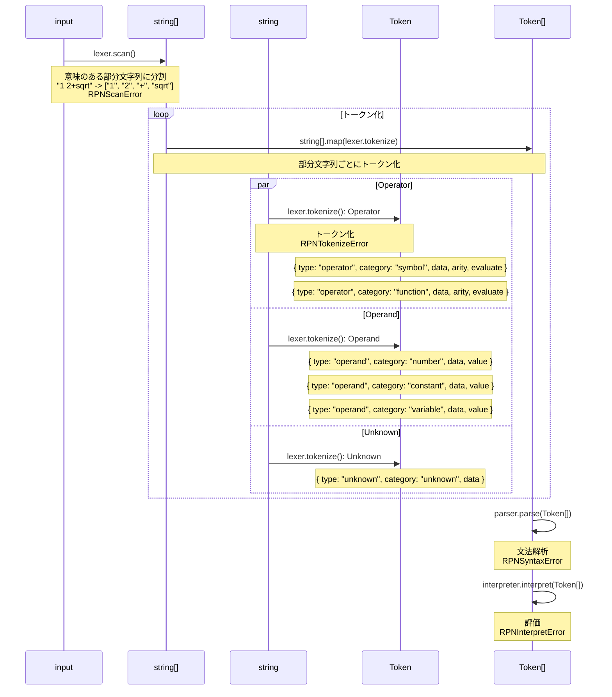
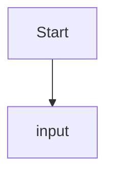

```mermaid
%% Reverse Polish Notation
sequenceDiagram
  participant input
  participant string[]
  participant string
  participant Token
  participant Token[]

  input ->> string[]: lexer.scan()
  Note over input, string[]: 意味のある部分文字列に分割<br>"1 2+sqrt" -> ["1", "2", "+", "sqrt"]<br>RPNScanError
  
  loop トークン化
    string[] ->> Token[]: string[].map(lexer.tokenize)
    Note over string[], Token[]: 部分文字列ごとにトークン化
    par Operator
      string ->> Token: lexer.tokenize(): Operator
      Note over string, Token: トークン化<br>RPNTokenizeError
      Note over Token: { type: "operator", category: "symbol", data, arity, evaluate }
      Note over Token: { type: "operator", category: "function", data, arity, evaluate }
    and Operand
      string ->> Token: lexer.tokenize(): Operand
        Note over Token: { type: "operand", category: "number", data, value }
        Note over Token: { type: "operand", category: "constant", data, value }
        Note over Token: { type: "operand", category: "variable", data, value }
    and Unknown
      string ->> Token: lexer.tokenize(): Unknown
        Note over Token: { type: "unknown", category: "unknown", data }
    end
  end

  Token[] ->> Token[]: parser.parse(Token[])
    Note over Token[], Token[]: 文法解析<br>RPNSyntaxError

  Token[] ->> Token[]: interpreter.interpret(Token[])
    Note over Token[], Token[]: 評価<br>RPNInterpretError
```

```mermaid
flowchart TD
  Start --> input
```
